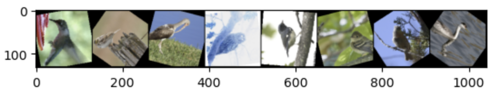
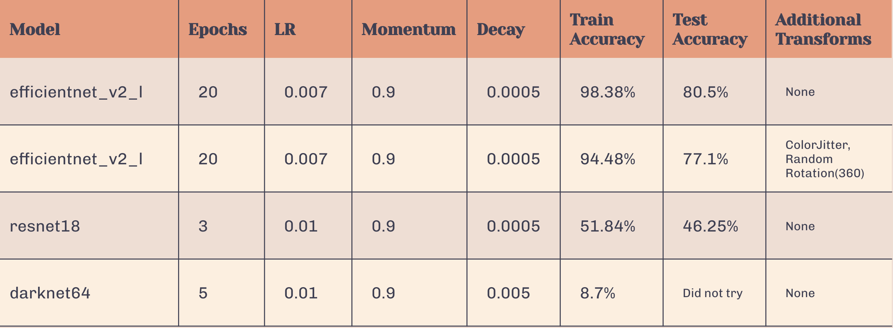
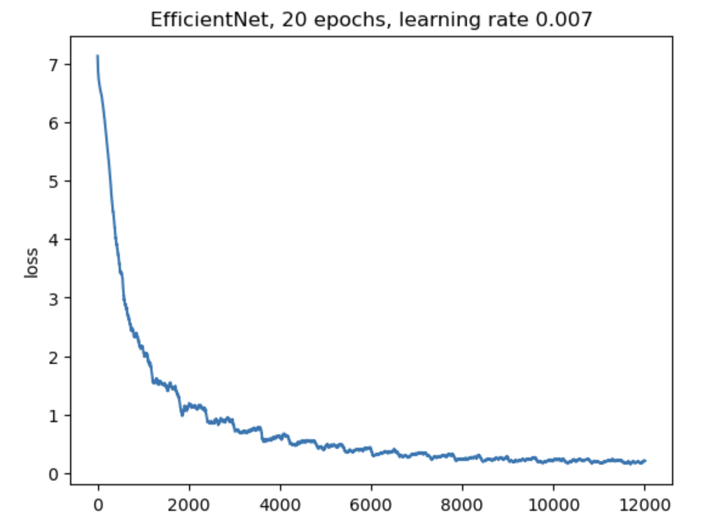
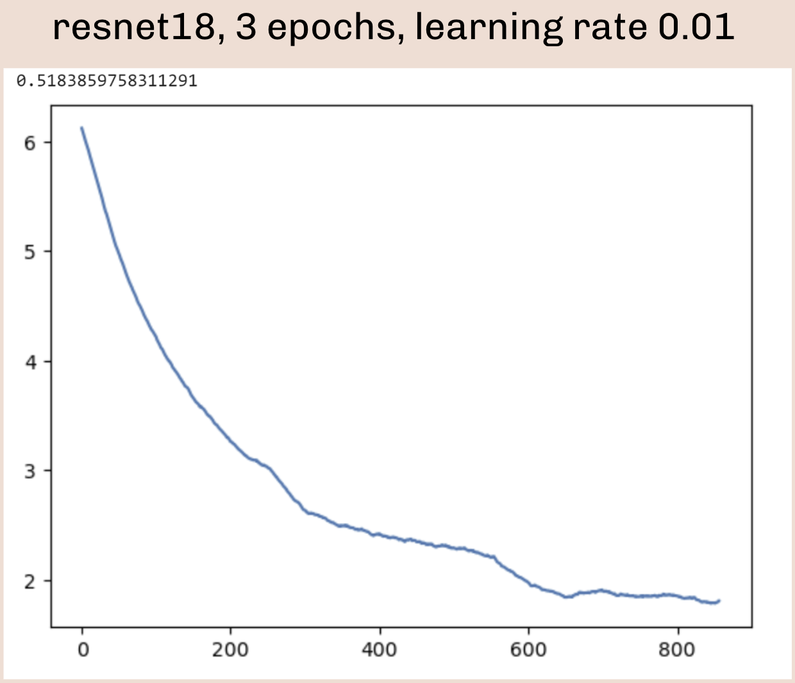
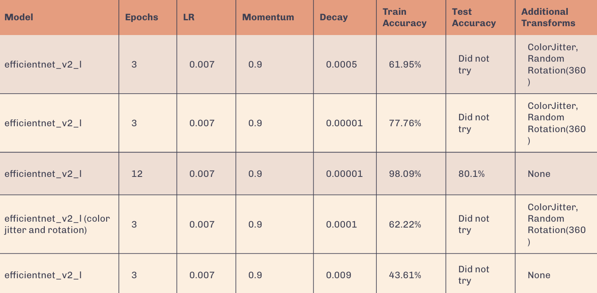

# 455 Final Project

## Welcome to our bird classifier project! 🐦🐦‍⬛🐥🦆🦅🦉

View our Kaggle notebook in `bird-classifier.ipynb` and view the notebook's outputs in `bird-classifier-final-outputs.ipynb`

### 📝 Contents
* [Video](#video)
* [Problem Statement](#problem-statement)
* [Approach](#approach)
* [Dataset](#dataset)
* [Results](#results)
* [Discussion](#discussion)
* [Resources](#resources)
* [Team Members](#team)

### 🎥 [Video](https://washington.zoom.us/rec/play/1ItdNdfXBQ5TZxaUZB-Wbwet0F947fXXPcoM3jWfdd4bF5GuIL2R7joAiDhNyoRHM43I5z6DUgSwECpO.0uyjmT7yHKNUq-Zx?autoplay=true&startTime=1686105507000) ------------------------------------------------------------ 
* Our video walks through the elements of our project, including a demo of the notebook and its code outputs.

### ❓ Problem Statement ------------------------------------------------------------ 
* We decided to enter the class’s [bird classification challenge](https://www.kaggle.com/competitions/birds23sp) on Kaggle, where the task is to classify different bird species given images of birds as input.

### 🤔 Approach ------------------------------------------------------------ 
**Pretrained Models:**
* efficientnet_v2_l
* resnet18

**Notebooks:**
* [ImageNet and Transfer Learning](https://colab.research.google.com/drive/1EBz4feoaUvz-o_yeMI27LEQBkvrXNc_4?usp=sharing)
  * train() and accuracy() methods
* [Transfer Learning to Birds](https://colab.research.google.com/drive/1kHo8VT-onDxbtS3FM77VImG35h_K_Lav?usp=sharing)
  * predict() method

**Data Augmentation with torchvision Transforms:**
* Random rotation with varying degrees
  * Parameter: degree range to randomly rotate an image to
* Random inversion of the colors in an image with default probability of 50%
* Color jitter: changes (“jitters”) the brightness, contrast, saturation, and hue of an image

**Evaluation:**
* Tested and compared different pretrained models
  * efficientnet, resnet18, darknet (example from class)
* Tested and compared different hyperparameters
  * Epochs, learning rate, momentum, decay

### 🗂 Dataset ------------------------------------------------------------ 
* Provided with train and test datasets in the Kaggle competition
  * Collections of bird images
* labels.csv file
  * Labels the individual bird images with a bird species identifier

### 📉 Results ------------------------------------------------------------ 

**Best Result:**
* Model: efficientnet_v2_l
* Test accuracy: 80.5%
* Train accuracy: 98.38%

**Analysis:**
* Between efficientnet_v2_l, resnet18, and darknet64, the model that yielded the highest accuracies was efficientnet_v2_l.
* Upon adding more data augmentation (namely, ColorJitter() and RandomRotation(360)) before training efficientnet_v2_l, we expected the training and test accuracies to increase. However, they unexpectedly decreased slightly. This suggests that the combination of data augmentations used makes a difference, and perhaps our selected rotation range of 360 degrees might have been too high.

### 📝 Discussion ------------------------------------------------------------ 
**Problems Encountered:**
* We originally wanted to do the [American Sign Language Fingerspelling Recognition](https://www.kaggle.com/competitions/asl-fingerspelling/overview) Kaggle competition, but with our limited experience it was difficult to work with, since the dataset is based on generated coordinates from videos of fingerspelling sequences.
* Training took a long time, making it impractical to do as many trials as we would have liked to with varying hyperparameters.
* The Kaggle notebook interface was not the most efficient to work with, since we were unable to collaborate live on the same notebook.

**Uniqueness of Approach:**
* In addition to trying several different models, we also tried several different data augmentation technqiues.
* Specifically, we experimented with RandomRotation, RandomInvert, ColorJitter, and RandomEqualize.
* Though we experimented, we were surprised to see that some combinations of data augmentation did not have a very positive effect on the final accuracy.
 * For instance, we used RandomRotation(360) on efficientnet_v2_l and it resulted in lower accuracies than without it.
* In addition, we researched and found the pretrained model that worked the best for our application (EfficientNet), rather than just picking one and trying to improve on it.

**Next Steps:**
* Further tuning of hyperparameters
* Gather a larger dataset to train on
* Try more pretrained models and compare their performance
* Isolate data augmentation methods to understand the specific effect of each one
* Implement dropout to help with overfitting

### 🤓 Resources ------------------------------------------------------------ 
* [ImageNet and Transfer Learning](https://colab.research.google.com/drive/1EBz4feoaUvz-o_yeMI27LEQBkvrXNc_4?usp=sharing)
* [Transfer Learning to Birds](https://colab.research.google.com/drive/1kHo8VT-onDxbtS3FM77VImG35h_K_Lav?usp=sharing)
* [EfficientNet](https://pytorch.org/hub/nvidia_deeplearningexamples_efficientnet/)
* [Data Augmentation](https://pytorch.org/vision/stable/transforms.html)

### 👩‍💻👨‍💻 Team Members ------------------------------------------------------------ 
* Rachel Alwan
* Alamjit Choat
* Gautam Maybhate
* Zephyr Tao

